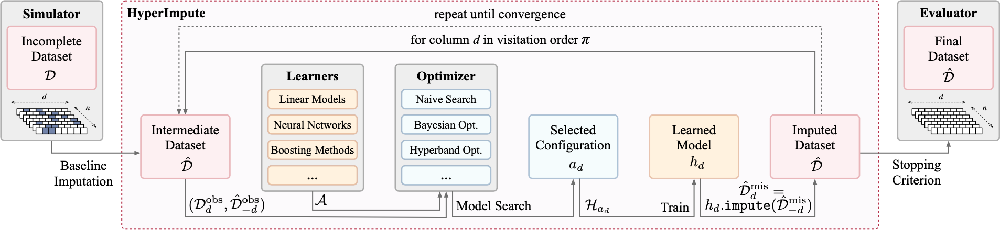

---
author:
- 'Bogdan Cebere(User : bcebere)'
title: |
  Genentech -- 404 Challenge\
  Description for Submission ID \#28855496.
---

Challenge review {#section:data_checks}
================

Given a clinical time series dataset with missing values, complete the
empty values. The patients are indexed by the id, and for each patient,
the temporal index is given by \"VISCODE\".

-   While a time series problem, several patients have a single
    visit(255 in the training set), which should be handled as a
    static/horizontal imputation problem.

-   Features \"PTGENDER\_num\", \"PTEDUCAT\", \"APOE4\" are constant for
    each patient and need special handling - we should not have multiple
    values by \"RID\_HASH\".

-   There is a correlation between \"VISCODE\" and the \"AGE\", which
    must be respected. More precisely, 1 \"VISCODE\" step maps to 1
    month. \"VISCODE\" = 6 maps to 6 months after the baseline visit.

-   The rest of the features are temporal, depending on the
    \"RID\_HASH\" and \"VISCODE\"/\"AGE\".

-   \"CDRSB\" is a multiple of $0.5$.

-   \"DX\_NUM\" and \"MMSE\" must be integers.

-   \"ADAS13\" is multiple of $1/3$.

Building blocks for the solution
================================

The solution tries to construct an iterative imputation method in 2
dimensions - both static/horizontal and temporal/vertical imputation.

We first describe each building block and, finally, how to components
interact.

Dataset augmentation
--------------------

#### Data preprocessing

: [\[section:preprocessing\]]{#section:preprocessing
label="section:preprocessing"}

1.  Sort the dataset by the tuple (\"RID\_HASH\", \"VISCODE\"). This
    speeds up the processing.

2.  Augment each row with some temporal details: **total known visits**
    and **last known visit** for the current patient.

3.  Using a MinMaxScaler, scale the columns \"MMSE\", \"ADAS13\",
    \"Ventricles\", \"Hippocampus\", \"WholeBrain\", \"Entorhinal\",
    \"Fusiform\", \"MidTemp\". While this initially was for the Neural
    Nets experiments, it also helped some linear models in the
    longitudinal imputation.

While the visits are not complete in the test set, adding the total
visits and last known visit improved the public score.

#### Other failed approaches

to augment the dataset include:

-   Learn a latent space using an RNN, LSTM, or Transformer, - from each
    row and its missingness mask - and append it to each row.

-   Add details related to trends from \[Ventricles,
    Hippocampus,WholeBrain, Entorhinal, Fusiform, MidTemp\].

While these approaches might help in a forecasting problem, they didn't
improve the imputation error here. The latent space isn't trivial to
model with missing values, and the neural net seemed to overfit the
\"dev\_set\", leading to a poor score on the test data. The trends
didn't help either, as the missingness mangled them.

While some more additional augmentations would be ideal, only the
\"total\_visits\" and \"last\_visit\" didn't affect the public test
score.

Static features {#section:static_features}
---------------

While trivial, the first step of the imputation is a good sanity check.

For each static feature: \[\"PTGENDER\_num\", \"PTEDUCAT\", \"APOE4\"\],
we propagate the existing values for a patient to all the time points.

For the \"AGE\" feature, we propagate the value using the \"VISCODE\"
value. More precisely, for observations $i$ and $i + 1$ for a patient,
we use the formula
$\text{AGE}[i + 1] = (\text{VISCODE}[i + 1] - \text{VISCODE}[i]) / 12 + \text{AGE}[i]$.

Iterative Horizontal(visit-wise) imputation {#section:horizontal_imputation}
-------------------------------------------

Next, we need a method for imputing a single visit. Given a single visit
row, with some missing values, we should be able to impute the missing
values from the observed ones. This step ignores the temporal setup. The
main benefits of the horizontal imputation are:

1.  It addresses the patients with single visits, which cannot be
    induced from temporal values.

2.  It handles the static features of each patient - (\"PTGENDER\",
    \"PTEDUCAT\", \"APOE4\").

3.  It can be used as a seed for the longitudinal imputer, by imputing a
    single visit - the easiest to impute statically. Starting from that,
    the longitudinal imputer can deduct the other temporal values.

For the task, we are using **HyperImpute**([@hyperimpute2022],
[@hyperimpute2022github]), an iterative imputation algorithm, which
generalizes MICE and missForest, by allowing any type of base
learner(not just linear/random forest), and which uses AutoML to tune
the models by column and by iteration. Figure
[\[hyperimpute:general\_diagram\]](#hyperimpute:general_diagram){reference-type="ref"
reference="hyperimpute:general_diagram"} shows the high-level
architecture of the iterative method, which we'll extend to the
longitudinal dimension for the current dataset.

{width="\\textwidth"}

The pool of **base learners** for HyperImpute is:

-   *classifiers*: \"xgboost\", \"catboost\", \"logistic\_regression\",
    \"random\_forest\", \"lgbm\".

-   *regressor*: \"xgboost\_regressor\", \"catboost\_regressor\",
    \"linear\_regression\", \"random\_forest\_regressor\",
    \"lgbm\_regressor\".

For selecting a classifier, the internal optimizer searches for the
maximal **AUCROC** score obtained on the observed data(data without any
missing values). For selecting a regressor, the optimizer searches for
the maximal **R2 score** obtained on the observed data.

#### Model search

The models are evaluated for each column and for for each imputation
iteration. The evaluation is performed on observed data, and for each
target column, we use the rest of the features from each patient. For
example, for target \"AGE\", we benchmark a model trained on the patient
features without the \"AGE\" column.

Table
[\[tab:horizontal\_learners\]](#tab:horizontal_learners){reference-type="ref"
reference="tab:horizontal_learners"} contains a snippet from the test
set from the first imputation iteration.

Iterative Longitudinal imputation {#section:longitudinal_imputation}
---------------------------------

It is important for patients with multiple visits to impute constrained
by other visits.

HyperImpute is dedicated to static/instance-wise imputation and cannot
be used directly for time series imputation. However, we can use its
base learners for this task by preprocessing the data.

#### Preprocessing

Two sets of estimators are trained, the **forward** and **reverse**
imputers, for the direction in which we try to approximate a particular
feature.

For every target feature:

-   We retrieve the previous visit, given the direction we work in. For
    the direction *forward*, the previous visit is the previous
    \"VISCODE\". For the direction *reverse*, the previous visit is the
    next \"VISCODE\".

-   We generate a training set consisting of the previous visit, and the
    current visit without the target feature.

-   We evaluate the prediction capabilities of the current feature value
    from the previous visit + the other features from the same
    timestamp.

-   The 'prepare\_temporal\_data\" function from the notebooks
    implements this preprocessing.

#### Model Search

The search pool consists of \"XGBoost\", \"CatBoost\", \"LGBM\",
\"Random forest\", \"KNearestNeighbor\" and linear models. For each
feature, the objective task is to predict the next(for forward imputers)
or the previous(for the reverse imputers) value of a column. Similar to
the Horizontal imputation setup, we run the AutoML logic on the
preprocessed data, selecting the optimal AUCROC for classifiers and the
optimal R2 score for regressors.

Tables
[\[tab:temporal\_forward\_learners\_learners\]](#tab:temporal_forward_learners_learners){reference-type="ref"
reference="tab:temporal_forward_learners_learners"} and
[\[tab:temporal\_reverse\_learners\_learners\]](#tab:temporal_reverse_learners_learners){reference-type="ref"
reference="tab:temporal_reverse_learners_learners"} contain the models
that were selected for the current solution, for the longitudinal
imputation.

Putting the pieces together
===========================

The complete imputation algorithm is:

**Steps:**

1.  **Constants imputation:** Impute the constants \[\"PTGENDER\_num\",
    \"PTEDUCAT\", \"APOE4\"\] and the \"AGE\" from the existing observed
    data in $X$(discussed in Section
    [2.2](#section:static_features){reference-type="ref"
    reference="section:static_features"}).

2.  **Longitudinal imputation loop,** using the models from Section
    [2.4](#section:longitudinal_imputation){reference-type="ref"
    reference="section:longitudinal_imputation"}.

    1.  Create $X_{dummy}$, a support imputed version of $X$, created by
        propagating the last valid observation forward(using pandas'
        ffill) or using the next valid observation to fill the gap(using
        bfill). Where ffill/bfill cannot cover all the missingness,
        HyperImpute is used.

    2.  For each missing value from a column $C$:

        1.  If a previous value was observed in column $C$, we use the
            longitudinal imputers from the **forward** set to fill the
            value. The imputer uses the input values from $X_{dummy}$,
            if any are missing.

        2.  If a future value was observed in column $C$, we use the
            longitudinal imputers from the **reverse** set to fill the
            value. The imputer uses the input values from $X_{dummy}$,
            if any are missing.

        3.  If both previous and future values are observed for column
            $C$, we use both forward and reverse imputers, and average
            their output.

        4.  If the longitudinal imputers cannot fill any other values,
            break. Else, continue.

        5.  After this step, the missing features are completely
            unobserved for a patient. Otherwise, they would have been
            filled in the longitudinal loop.

3.  **Horizontal imputation**, using the models from Section
    [2.3](#section:horizontal_imputation){reference-type="ref"
    reference="section:horizontal_imputation"}. We run the horizontal
    imputation to fill in the missing values. For each patient, we merge
    the horizontal imputation into the rows with the *least missing
    values*. We are not using the full horizontal imputation because it
    could miss some temporal patterns. Instead, we use it to seed a
    second longitudinal imputation loop. In particular, this step
    imputes all the patients with a single visit.

4.  **Second Constants imputation:** Impute the constants and the
    \"AGE\", seeded by the horizontal imputation.

5.  **Second Longitudinal imputation loop.** Run the exact same
    longitudinal imputation loop, seeded by the horizontal imputation.

6.  **$X_{imputed}$ output** : $X$ is completely imputed at this point.

**Submission dataset.** For the final submission, a few extra steps are
executed:

1.  Unscale the scaled features from Section
    [\[section:preprocessing\]](#section:preprocessing){reference-type="ref"
    reference="section:preprocessing"}.

2.  Review the Data sanity checks, as detailed in Section
    [1](#section:data_checks){reference-type="ref"
    reference="section:data_checks"}.
